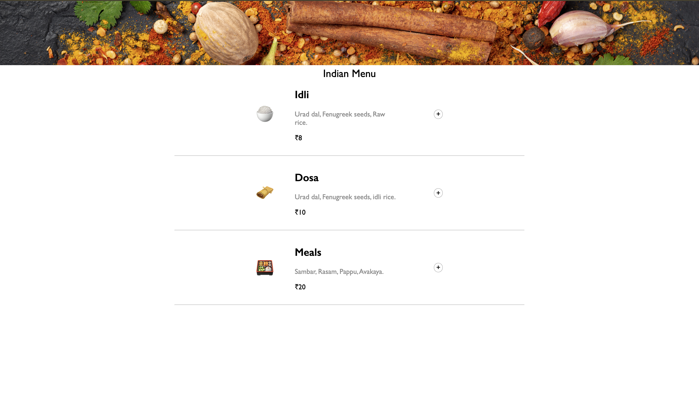
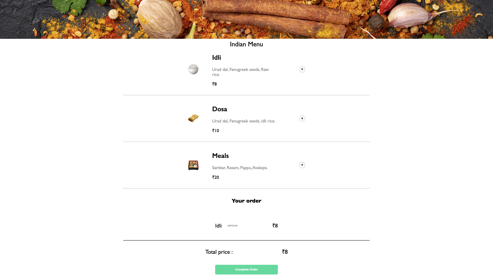

## Indian Restaurant menu
A simple web app that shows the artist’s South-Indian Restaurant menu, which contains name, ingredients, price, emoji and allowing users to place an order.

Built with simple HTML5, CSS3 and Vanilla JavaScript.

[ Let's Try in Live :)](https://gmarav05.github.io/restaurant-menu/)

## Video

https://github.com/user-attachments/assets/167aeab0-322c-40ba-abb8-106098b92f91

## Image
  

## Features

- Form Inputs are validated for further action.

- We can add items dynamically and price of the bill updates.

- When we click on complete order modal is show for payment details.

- After valid details user will be able to see confirmation message

## Learnings

- How to manipulate DOM with JavaScript Array Objects.

- How to use export/import modules.

- Practise of Modal. 

- Practise basic Accesibility.

- Forms and Inputs.

- Practise of more DOM.

- Practise of Flexbox.

## Live demo

[ View Live  :)](https://gmarav05.github.io/restaurant-menu/)
 
